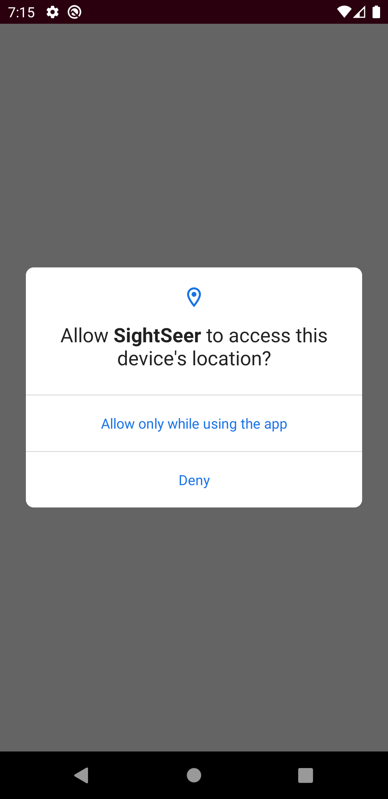
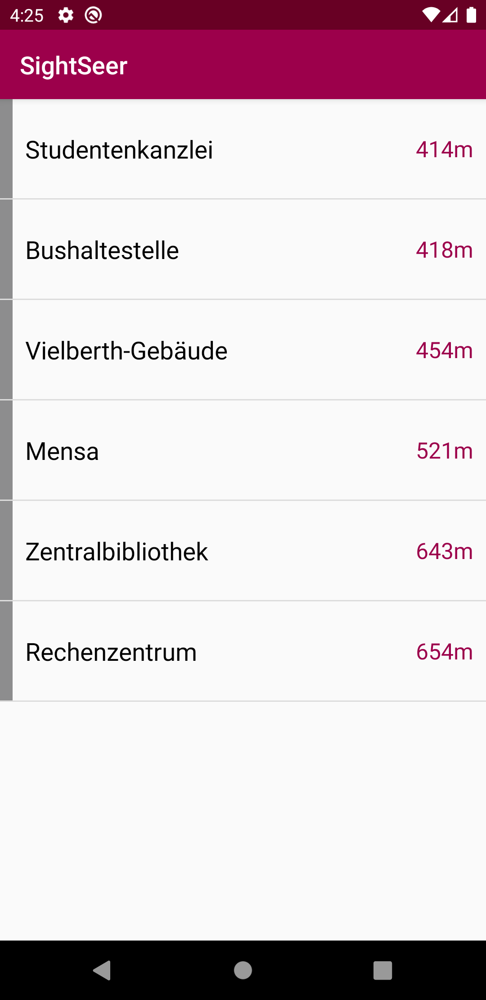
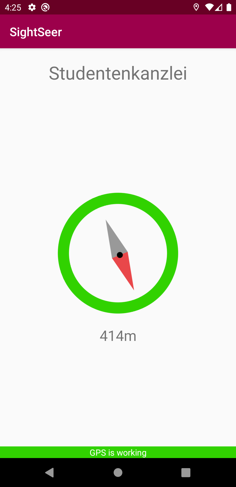

# U08 | Sightseer

## Aufgabe

Das Ziel dieser Aufgabe ist die Implementierung einer App zur Navigation am Campus der Universität Regensburg. Dazu soll der aktuelle Standpunkt des Smartphones mit den Positionsdaten einiger vorgegebener Orte in Verbindung gesetzt werden, um die Länge und die Zielrichtung der Route zu ermitteln.

## Hinweise

* Zum Abfragen der notwendigen Permissions kann der CompatContext verwendet werden. Tragen Sie diese auch im Manifest an der richtigen Stelle ein:
  * `Permissions`: https://developer.android.com/training/permissions/requesting
* Verwenden Sie Für die Abfrage und Verarbeitung der Positionsdaten die Vorlesung (VL9), sowie die Android-Dokumentation:
  * `Location`: https://developer.android.com/reference/android/location/Location
  * `LocationManager`: https://developer.android.com/reference/android/location/LocationManager
* Sie können die Location-Funktion der erweiterten Funktionen des Android Emulators verwenden, um die App von zu Hause zu testen. 

## Ausgangslage
* Die Layouts für die `LocationListActivity`, die `NavigationActivity` sowie das benötigte `location_list_item` für den Adapter sind bereits vorhanden und können so übernommen werden
* Die `Destination`-Klasse repräsentiert die Kartendaten zu bestimmten "Sehenswürdigkeiten". Die `NavigationDetail`-Klasse dürfen Sie dagegen als eine Art Wegbeschreibung von einer Location zu einem bestimmten Ziel verstehen
* Alle benötigten Klassen sind bereits erstellt. Machen Sie sich mit der Struktur vertraut und vervollständigen Sie die `NavigationController`-Klasse mit den notwendigen Methoden. Erstellen Sie Instanzvariablen wenn erforderlich. Integrieren Sie diesen zum Abschluss in die beiden Activities

## Vorgehen
### Anfragen der Berechtigungen 
Stellen Sie sicher dass die App über die notwendigen Berechtigungen verfügt. SightSeer muss in der Lage sein die `FINE_LOCATION` des Geräts abzufragen. Anders als beim ebenfalls erforderlichen Internetzugriff handelt es sich dabei um eine sensitivere Permission. Diese müssen zum Startzeitpunkt der Anwendung geprüft und angefragt werden.

Es wird empfohlen die Berechtigungen zusätzlich immer dann zu prüfen, wenn die ensprechende Funktion verwendet wird (auch im `NavigationController`).

Starten Sie die App an dieser Stelle auf dem Emulator, um zu testen, ob das Popup für die Berechtigung, wie auf dem Screenshot sichtbar, korrekt angezeigt wird.

### Auslesen der aktuellen Position
Kümmern Sie sich als nächstes darum, die Positionsdaten des Geräts auszulesen. Dafür benötigen Sie in der `NavigationController`-Klasse eine Instanzvariable vom Typ `LocationManager`.
Mithilfe eines `Criteria`-Objekts können Sie durch Setzen bestimmter Vorraussetzungen den passendsten Provider ermitteln. (Beispielsweise GPS, Mobile Daten, WIFI).
Hier verwenden wir folgende Eigenschaften:

* Genauigkeit: `ACCURACY_FINE`
* Leistungsbedarf: `POWER_MEDIUM`
* Ausrichtung erforderlich: `true`

Mit diesem Provider kann nun die tatsächliche Position über den LocationManager ausgelesen werden.

### Festlegen einer Ziellocation
Sorgen Sie dafür, dass dem `NavigationController` eine Instanz von `Destination` übergeben werden kann. Aus dieser soll, abhängig von der aktuellen Position, ein `NavigationDetail`-Objekt erzeugt und über das `NavigationListener`-Interface an die entsprechende Activity übergeben werden.

Um den Richtungs-Wert (bearing) zu erhalten, muss die Differenz aus dem Richtungswert zum Zielpunkt und dem an der aktuellen Position gebildet werden. Die Location-Klasse bietet hier passende Methoden.

### Navigationsfunktionalität
Implementieren Sie an dieser Stelle die Navigationsfunktionalität der App, indem Sie dem `LocationManager` mitteilen, dass der `NavigationController` über Positionsupdates informiert werden wollen.
In der Callback-Methode `onLocationChanged` erhalten Sie die neuen Locations. Wandeln Sie diese ebenfalls in ein `NavigationDetail` um und melden Sie dem `NavigationListener` die neuen Navigationsdaten. Teilen Sie ihm dann außerdem mit, dass ein Ortungssignal gefunden wurde.
Über die `onStatusChanged`-Methode erfahren Sie von potentiellen Statusänderungen. Vergleichen Sie hier mit `LocationProvider.TEMPORARILY_UNAVAILABLE` und informieren Sie in diesem Fall den `NavigationListener` von einem Signalverlust.

Um die Navigation zu stoppen, können Sie dem `LocationManager` einfach Bescheid geben, dass Sie keine Updates mehr erhalten wollen.

### Berechnen der Distanz
Vervollständigen Sie die vorgegebene Methode `getEstimatedDistanceForLocation` mithilfe der Methoden der `Location`-Klasse.

### Starten der Navigation
Verwenden Sie Ihren `NavigationController` nun in der `NavigationActivity`. Registrieren Sie diese dafür zunächst als Listener.
Anschließend können Sie die `Destination` festlegen. Diese erhalten Sie aus dem `JSON`-String, den Sie aus dem Intent auslesen und parsen können.

Sobald das Ziel festgelegt wurde, können Sie die Navigation über den `NavigationController` starten.

Wenn die App minimiert wird, sollten Sie die Navigation im Code manuell stoppen.

## Anhang
### Screenshots

| | | |
|-|-|-|
|{ height=8cm } |{ height=8cm } |{ height=8cm } |

